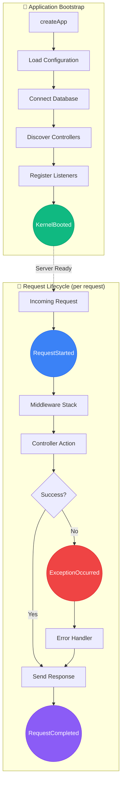

# Lockness Lifecycle Events

This guide covers the Lockness framework events system - a modern,
decorator-driven approach to event-driven architecture in your application.

> **Looking for API details?** See the [Events API Reference](/docs/events) for
> complete documentation of `EventEmitter`, `EventDispatcher`, and utility
> functions.

## Table of Contents

- [Introduction](#introduction)
- [Why Events?](#why-events)
- [Quick Start](#quick-start)
- [Events vs Middlewares](#events-vs-middlewares)
- [Defining Events](#defining-events)
- [Creating Listeners](#creating-listeners)
- [Lockness Lifecycle Events](#lockness-lifecycle-events)
- [Testing Events](#testing-events)
- [Best Practices](#best-practices)
- [Advanced Patterns](#advanced-patterns)

## Introduction

The Lockness events system provides a centralized, extensible way to hook into
your application lifecycle and define custom business events. It's inspired by
Symfony's EventDispatcher and AdonisJS Emitter, adapted for Deno's async-first
architecture.

## Why Events?

Events enable loose coupling between components. Instead of directly calling
services from your controllers, emit events and let listeners handle the work.

### Benefits

1. **Decoupling**: Controllers don't need to know about emails, analytics, etc.
2. **Extensibility**: Add new functionality without modifying existing code
3. **Testability**: Test listeners in isolation
4. **Third-party Integration**: Packages can react to your events
5. **Zero Configuration**: Auto-discovered - just create the files

## Quick Start

### 1. Create an Event

```bash
deno task cli make:event UserRegistered
```

This creates `app/events/user_registered.ts`:

```typescript
import { BaseEvent } from '@lockness/core'
import type { User } from '#models/user'

export class UserRegistered extends BaseEvent {
    constructor(
        public readonly user: User,
        public readonly ipAddress: string,
    ) {
        super()
    }
}
```

### 2. Create a Listener

```bash
deno task cli make:listener UserListener
```

This creates `app/listener/user_listener.ts`:

```typescript
import { Service } from '@lockness/container'
import { Listener } from '@lockness/core'
import { UserRegistered } from '#events/user_registered'

@Service()
export class UserListener {
    constructor(
        private mail: MailService,
        private analytics: AnalyticsService,
    ) {}

    @Listener(UserRegistered)
    async sendWelcomeEmail(event: UserRegistered) {
        await this.mail.send(event.user.email, 'Welcome!', {
            name: event.user.name,
        })
    }

    @Listener(UserRegistered, { priority: 10 })
    async trackRegistration(event: UserRegistered) {
        await this.analytics.track('user:registered', {
            userId: event.user.id,
        })
    }
}
```

### 3. Emit the Event

```typescript
import { dispatcher } from '@lockness/core'
import { UserRegistered } from '#events/user_registered'

@Controller('/auth')
export class AuthController {
    constructor(private userService: UserService) {}

    @Post('/register')
    async register(c: Context) {
        const user = await this.userService.create(c.req.parseBody())

        // Emit event
        await dispatcher().emit(
            new UserRegistered(user, c.req.header('x-real-ip')),
        )

        return c.json({ user })
    }
}
```

That's it! The listener is automatically discovered and registered on app boot.

## Events vs Middlewares

### When to Use Events

- **Non-blocking operations**: Analytics, logging, notifications
- **Multiple handlers**: Several services need to react
- **Third-party integration**: Packages reacting to your events
- **Business logic**: Domain events (OrderPlaced, PaymentReceived)

### When to Use Middleware

- **Request/response modification**: Auth, CORS, compression
- **Blocking operations**: Must complete before controller
- **Order-dependent**: Must run in specific sequence

### DX Comparison

**Without events** (middleware approach):

```typescript
// 1. Create middleware
@DeclareMiddleware('analytics')
export class AnalyticsMiddleware implements Middleware {
    async handle(c: Context, next: Next) {
        const start = performance.now()
        await next()
        await this.analytics.track(c.req.path, performance.now() - start)
    }
}

// 2. Register in kernel
globalMiddlewares = [
    sessionMiddleware(),
    AnalyticsMiddleware, // ← Manual registration
]
```

**With events**:

```typescript
// Just create the listener - auto-discovered!
@Service()
export class AnalyticsListener {
    constructor(private analytics: AnalyticsService) {}

    @Listener(RequestCompleted)
    async onRequest(event: RequestCompleted) {
        await this.analytics.track(event.path, event.duration)
    }
}
```

**Friction**: 1 file vs 2 files + kernel modification

## Defining Events

Events are immutable data containers that extend `BaseEvent`:

```typescript
import { BaseEvent } from '@lockness/core'

export class OrderPlaced extends BaseEvent {
    constructor(
        public readonly orderId: string,
        public readonly userId: string,
        public readonly total: number,
        public readonly items: OrderItem[],
    ) {
        super()
    }
}
```

### Event Naming

Follow these conventions:

- **Past tense**: `UserRegistered`, `OrderPlaced`, `PaymentReceived`
- **Domain-specific**: Reflect your business domain
- **Descriptive**: Clear what happened

### Event Data

Only include data that listeners need:

```typescript
// ✅ Good - includes relevant data
export class PaymentProcessed extends BaseEvent {
    constructor(
        public readonly paymentId: string,
        public readonly orderId: string,
        public readonly amount: number,
        public readonly method: string,
    ) {
        super()
    }
}

// ❌ Bad - includes entire request
export class PaymentProcessed extends BaseEvent {
    constructor(
        public readonly request: Request,
    ) {
        super()
    }
}
```

## Creating Listeners

Listeners are services with `@Listener` decorated methods:

```typescript
import { Service } from '@lockness/container'
import { Listener } from '@lockness/core'
import { OrderPlaced } from '#events/order_placed'

@Service()
export class OrderListener {
    constructor(
        private mail: MailService,
        private inventory: InventoryService,
    ) {}

    @Listener(OrderPlaced)
    async sendConfirmation(event: OrderPlaced) {
        await this.mail.send(event.userId, 'Order Confirmation')
    }

    @Listener(OrderPlaced, { priority: 100 })
    async updateInventory(event: OrderPlaced) {
        await this.inventory.decrement(event.items)
    }
}
```

### Listener Priorities

Higher priority = executes first (default: 0)

```typescript
@Listener(OrderPlaced, { priority: 100 })  // Runs first
async criticalTask(event: OrderPlaced) {}

@Listener(OrderPlaced, { priority: 50 })   // Runs second
async importantTask(event: OrderPlaced) {}

@Listener(OrderPlaced)                      // Runs last (priority: 0)
async normalTask(event: OrderPlaced) {}
```

### Multiple Events per Listener

One listener can handle multiple events:

```typescript
@Service()
export class NotificationListener {
    constructor(private mail: MailService) {}

    @Listener(UserRegistered)
    async onUserRegistered(event: UserRegistered) {
        await this.mail.send(event.user.email, 'Welcome!')
    }

    @Listener(OrderPlaced)
    async onOrderPlaced(event: OrderPlaced) {
        await this.mail.send(event.userId, 'Order Confirmation')
    }

    @Listener(PaymentReceived)
    async onPaymentReceived(event: PaymentReceived) {
        await this.mail.send(event.userId, 'Payment Received')
    }
}
```

### Error Handling

Listeners should handle their own errors:

```typescript
@Listener(OrderPlaced)
async sendConfirmation(event: OrderPlaced) {
    try {
        await this.mail.send(event.userId, 'Order Confirmation')
    } catch (error) {
        // Log error but don't throw - other listeners should still run
        console.error('Failed to send confirmation:', error)
        await this.errorLogger.log(error)
    }
}
```

## Lockness Lifecycle Events

The framework emits events at critical execution points:



**Event firing order:**

| Order | Event               | When                          | Use Case                           |
| ----- | ------------------- | ----------------------------- | ---------------------------------- |
| 1     | `KernelBooted`      | App fully initialized (once)  | Cache warmup, external connections |
| 2     | `RequestStarted`    | HTTP request received         | Logging, request tracking          |
| 3     | `ExceptionOccurred` | Error during request (if any) | Error reporting, alerting          |
| 4     | `RequestCompleted`  | Response sent                 | Metrics, cleanup, background tasks |

### KernelBooted

App finished bootstrapping - use for initialization:

```typescript
@Listener(KernelBooted)
async onBoot(event: KernelBooted) {
    await this.cache.warmup()
    console.log(`${event.appName} ready in ${event.environment}`)
}
```

### RequestStarted

Beginning of HTTP request - use for logging, analytics:

```typescript
@Listener(RequestStarted)
logRequest(event: RequestStarted) {
    this.logger.info(`${event.method} ${event.path}`, {
        requestId: event.requestId,
    })
}
```

### RequestCompleted

After response sent - use for metrics, background tasks:

```typescript
@Listener(RequestCompleted)
async collectMetrics(event: RequestCompleted) {
    await this.metrics.record({
        path: event.path,
        statusCode: event.statusCode,
        duration: event.duration,
    })
}
```

### ExceptionOccurred

Unhandled exception - use for error reporting:

```typescript
@Listener(ExceptionOccurred)
async reportError(event: ExceptionOccurred) {
    if (event.error.name !== 'HttpException') {
        await this.sentry.captureException(event.error)
    }
}
```

## Testing Events

### Faking Events

```typescript
import { fake, restore } from '@lockness/core'
import { UserRegistered } from '#events/user_registered'

Deno.test('user registration emits event', async () => {
    const fakeBuffer = fake()

    await userService.register({ email: 'test@example.com' })

    // Assert event was emitted
    fakeBuffer.assertEmitted(UserRegistered)
    fakeBuffer.assertEmittedCount(UserRegistered, 1)

    // Assert event data
    fakeBuffer.assertEmitted(UserRegistered, (event) => {
        return event.user.email === 'test@example.com'
    })

    restore()
})
```

### Testing Listeners

Test listeners in isolation:

```typescript
Deno.test('UserListener sends welcome email', async () => {
    const mockMail = new MockMailService()
    const listener = new UserListener(mockMail)

    await listener.sendWelcomeEmail(new UserRegistered(testUser, '127.0.0.1'))

    assertEquals(mockMail.sent.length, 1)
    assertEquals(mockMail.sent[0].to, 'test@example.com')
})
```

## Best Practices

### 1. Keep Events Simple

Events are data containers - no logic:

```typescript
// ✅ Good
export class OrderPlaced extends BaseEvent {
    constructor(
        public readonly orderId: string,
        public readonly total: number,
    ) {
        super()
    }
}

// ❌ Bad - has methods
export class OrderPlaced extends BaseEvent {
    constructor(public readonly order: Order) {
        super()
    }

    calculateTax(): number { // ❌ Don't do this
        return this.order.total * 0.08
    }
}
```

### 2. Use Specific Event Names

```typescript
// ✅ Good - specific
UserRegistered
OrderPlaced
PaymentProcessed

// ❌ Bad - too generic
DataChanged
Updated
Processed
```

### 3. Don't Emit Too Many Events

Not every action needs an event:

```typescript
// ✅ Good - meaningful events
await dispatcher().emit(new UserRegistered(user))
await dispatcher().emit(new OrderPlaced(order))

// ❌ Bad - too granular
await dispatcher().emit(new ValidationStarted())
await dispatcher().emit(new ValidationPassed())
await dispatcher().emit(new DatabaseQueryStarted())
await dispatcher().emit(new DatabaseQueryCompleted())
```

### 4. Keep Listeners Focused

One concern per listener method:

```typescript
// ✅ Good - focused
@Listener(UserRegistered)
async sendWelcomeEmail(event: UserRegistered) {
    await this.mail.send(event.user.email, 'Welcome!')
}

@Listener(UserRegistered)
async trackRegistration(event: UserRegistered) {
    await this.analytics.track('user:registered')
}

// ❌ Bad - does too much
@Listener(UserRegistered)
async handleRegistration(event: UserRegistered) {
    await this.mail.send(event.user.email, 'Welcome!')
    await this.analytics.track('user:registered')
    await this.crm.createContact(event.user)
    await this.slack.notify(`New user: ${event.user.email}`)
}
```

### 5. Avoid Circular Dependencies

Don't emit events from within listeners of the same event:

```typescript
// ❌ Bad - infinite loop
@Listener(OrderPlaced)
async handleOrder(event: OrderPlaced) {
    // Don't emit OrderPlaced from within OrderPlaced listener!
    await dispatcher().emit(new OrderPlaced(...))
}
```

## Advanced Patterns

### Event Sourcing

Use events as the source of truth:

```typescript
interface AccountEvents {
    'account:deposited': { amount: number }
    'account:withdrawn': { amount: number }
}

@Service()
export class AccountListener {
    private balance = 0

    @Listener(AccountDeposited)
    onDeposit(event: AccountDeposited) {
        this.balance += event.amount
    }

    @Listener(AccountWithdrawn)
    onWithdraw(event: AccountWithdrawn) {
        this.balance -= event.amount
    }
}
```

### Cross-Package Communication

Packages can react to your events:

```typescript
// Your app emits
await dispatcher().emit(new OrderPlaced(order))

// @lockness/devtools listens (automatically)
@Listener(OrderPlaced)
collectForDevtools(event: OrderPlaced) {
    this.collector.addEvent(event)
}
```

### Saga Pattern

Coordinate multi-step processes:

```typescript
@Service()
export class OrderSaga {
    @Listener(OrderPlaced, { priority: 100 })
    async reserveInventory(event: OrderPlaced) {
        await this.inventory.reserve(event.items)
        await dispatcher().emit(new InventoryReserved(event.orderId))
    }

    @Listener(InventoryReserved)
    async processPayment(event: InventoryReserved) {
        await this.payment.charge(event.orderId)
        await dispatcher().emit(new PaymentProcessed(event.orderId))
    }

    @Listener(PaymentProcessed)
    async confirmOrder(event: PaymentProcessed) {
        await this.order.confirm(event.orderId)
        await dispatcher().emit(new OrderConfirmed(event.orderId))
    }
}
```

## Directory Structure

```
app/
├── events/                    # Event class definitions
│   ├── user_registered.ts
│   ├── order_placed.ts
│   └── payment_received.ts
├── listener/                  # Auto-discovered listeners
│   ├── user_listener.ts
│   ├── order_listener.ts
│   └── notification_listener.ts
└── ...
```

## Configuration

Listeners are configured via the `config/listeners.ts` file and the kernel:

### Listeners Directory (Auto-Discovery)

By default, listeners in `app/listener/` are auto-discovered during bootstrap:

```typescript
@Kernel({
    listenersDir: './app/listener', // Optional, this is the default
})
export class AppKernel {}
```

### Package Listeners Configuration

To enable listeners from packages, add them to `config/listeners.ts`:

```typescript
// config/listeners.ts
import type { ListenerClass } from '@lockness/core'
import { DevtoolsListener } from '@lockness/devtools'
import { CacheInvalidationListener } from '@lockness/cache'

export const listeners: ListenerClass[] = [
    DevtoolsListener,
    CacheInvalidationListener,
]
```

The kernel references this config:

```typescript
// app/kernel.ts
import { config } from '../config/mod.ts'

@Kernel({
    listenersDir: './app/listener',
    listeners: config.listeners,
})
export class AppKernel {}
```

> **Note:** Both `listenersDir` (auto-discovery) and `listeners` (explicit) work
> together. Listeners from the directory are auto-discovered, and explicit
> listener classes are also registered.

## See Also

- [Events API Reference](/docs/events) - Complete API documentation for
  `EventEmitter`, `EventDispatcher`, utilities (`waitForEvent`, `eventStream`,
  `createEventBus`), and low-level string-based events
- [Dependency Injection](/docs/dependency-injection)
- [Testing Guide](/docs/testing)
